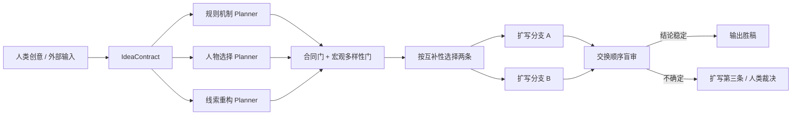

# Claudenovel Branch-first 可行性实验报告

日期：2026-07-13  
结论：**Branch-first + Adaptive Expand 通过两切点可行性门槛，进入主方向；暂不直接替换生产管线。**

本轮只判断质量、稳定性和对人类创意输入的服从程度。推理加速、token 成本和延迟不作为当前验收目标。

## 1. 核心假设

与其让多个 Writer 直接写出三篇完整正文，再从相似稿件中挑一篇，不如先让相互隔离的 Planner 提出宏观机制真正不同的 Branch Card，经创意合同和多样性门筛选后，只扩写两条最互补的分支。

人类输入始终位于最上游。Agent 只在 IdeaContract 的 freedom budget 内补全实现方式，不能替换 idea lock 或禁改项。

## 2. 实验协议

测试切点来自《地府微信群》前期：

- 第 11 章后：现实冲突必须由已有地府资源产生后果，且主角不能轻易碾压。
- 第 16 章后：鬼瞳、鬼耳首次生效，主角发现校园中一直近在身边的灵异问题，室友不能立刻完全知情，危机不能当场消灭。

每个切点执行：

1. 三个隔离 Planner 分别从规则机制、人物选择、线索重构出发生成 Branch Card。
2. 创意合同门拒绝越权设定；宏观多样性门拒绝“换名不换事”的分支。
3. 盲选两条互补分支，而不是简单取单卡平均分前二。
4. 两个隔离 Writer 扩写正文。
5. 两名新审查者以相反 A/B 顺序盲审；映射后胜者一致才正式选中。
6. 只有评审不确定时才扩写第三条。本轮两个切点的内部选稿都稳定，因此未触发第三条。

## 3. 过程发现

### 3.1 合同门不是可选项

第 11 章第一轮有分支擅自创造“同伤符”作为关键解法。它不属于公开设定或允许的自由预算，被拒绝后重新生成，改为利用已出现的朱颜果。

这证明仅靠提示词要求“不要越权”不够，架构中需要独立、可失败的合同门。

### 3.2 词面不同不等于剧情不同

第 16 章第一轮三张卡都收敛到“宿舍夜间点名/查寝鬼”，虽然 n-gram 表面相似度很低，宏观事件却几乎相同。多样性门拒绝其中两张并定向再生后，得到：

- 慢一拍复刻动作的影鬼；
- 借废弃校园广播出现的女鬼；
- 被改建宿舍覆盖的旧楼层与缺席四号床。

因此下一版多样性判断必须比较事件指纹，而不是只比较 embedding 或词面差异。至少应显式比较：冲突空间、触发器、核心鬼物/资源、高潮动作、角色代价、尾钩。

### 3.3 选“互补组合”优于取单卡前二

第 11 章的 branch_03 单卡平均评价最高，但选择器最终以 2:1 选择 branch_01 + branch_02，因为二者分别代表规则试探和人物牺牲，组合覆盖更完整。这正是先规划再扩写能提供、直接全文采样难以控制的优势。

## 4. 内部分支选稿结果

| 切点 | 扩写分支 | 交换顺序结果 | 正式胜稿 | 主要原因 |
|---|---|---|---|---|
| 第 11 章后 | branch_01 vs branch_02 | 两次均映射到 branch_01，0.78 / 0.78 | [branch_01](after_chapter_11/candidates/branch_01.md) | 把朱颜果转化为“正面注视才削弱施暴意愿、盲区仍可攻击”的有限规则，创意落实与因果链更强 |
| 第 16 章后 | branch_01 vs branch_03 | 两次均映射到 branch_03，0.72 / 0.82 | [branch_03](after_chapter_16/candidates/branch_03.md) | 由旧地面高度、穿越现家具的路线、旧门槛接缝推导被覆盖宿舍，谜面、解法与尾钩统一 |

两组内部选稿均不受 A/B 顺序影响，故未扩写第三条。

## 5. 与 Direct-best 基线的盲测

| 切点 | 对手 | forward 映射 | reverse 映射 | 结论 |
|---|---|---|---|---|
| 第 11 章后 | 旧 direct candidate_02 | branch_01，0.84 | direct_02，0.84 | **不确定** |
| 第 16 章后 | 旧 direct candidate_01 | branch_03，0.92 | branch_03，0.90 | **Branch-first 明确胜出** |
| 第 16 章后 | 旧 direct candidate_02 | branch_03，0.78 | branch_03，0.78 | **Branch-first 明确胜出** |

汇总：**1 个切点明确提升，1 个切点不确定，0 个切点明确退步。**

第 11 章的不确定并非简单的审美平票：两个独立审查者都选择了自己 prompt 中位于 A 位置的稿件，交换映射后恰好相反。这暴露了评审协议的位置敏感性。系统应当诚实 abstain，不能用平均总分强行制造胜者。

第 16 章的提升较稳定。Branch-first 稿件相对两个旧强基线的共同优势是：关键转折来自主角对现场空间错位的主动观察，而不是配角集中解释规则或危急时恰好得到对症资源；“被新宿舍覆盖的旧四号床”也把能力展示、校园旧患和后续危机收束为同一个核心谜团。

## 6. 架构收敛结论

### 保留为主干的设计

1. **Human Idea First**：IdeaContract、idea lock、禁改项和 freedom budget 是最高优先级输入。
2. **Branch before Prose**：先比较剧情机制，再投入完整正文。
3. **正交 Planner 职责**：规则机制、人物选择、线索重构；但职责标签不能替代多样性检查。
4. **双门禁**：合同门负责“没有背叛人的想法”，事件多样性门负责“分支真的不同”。
5. **按组合互补性选择两条**：不是取独立分数最高的两条。
6. **交换顺序盲审并允许弃权**：结果稳定才自动选中；不稳定时扩写第三分支或交给人。
7. **选择胜稿，不拼接句子**：不同分支的因果机制不可在正文末端机械融合；如需融合，应返回规划层重新生成新卡。

### 下一阶段必须改进的两点

1. **语义事件指纹门**  
   把每张卡规范化为 `conflict_space / trigger / core_mechanism / climax_action / cost_type / end_hook`。任意两张至少在三个轴上有实质差异，否则定向再生。现有词面相似度只能作辅助信号。

2. **先独评、后比较的审查协议**  
   审查者先在看不到另一篇得分的条件下，分别给出带证据的 rubric score，再进行 pairwise 决策；仍需交换顺序。若映射冲突，官方结果必须是 `judge_uncertain`，再触发第三分支或人类裁决。第 11 章将作为该协议的校准样本。

## 7. 下一轮实验与验收线

建议继续覆盖原 benchmark 的另外四个切点，而不是立刻改生产默认值。下一轮同时启用事件指纹门和“先独评、后比较”审查。

进入生产实验开关前至少满足：

- 六个切点的创意合同硬门通过率 100%，不得靠审查阶段容忍越权设定。
- 任意入围分支对在六个事件轴上至少三项实质不同。
- 相对 direct-best，明确胜出不少于 3 个切点，明确落败不多于 1 个；其余允许不确定。
- 交换顺序后的映射一致或主动弃权，不以位置敏感结果自动发布。
- 外部创意落实不得低于 direct-best；它是硬约束，不由文风优势抵消。

本轮不设置速度或 token 成本门槛。

## 8. 工程验证

- 实验工具覆盖 Branch Card 生成、schema 校验、选择提示、交换顺序映射和结果聚合。
- 全量测试：`51 passed`。
- 本轮没有把 Branch-first 接入生产 `agent_writer` 默认路径；改动保持在实验层，便于继续校准。

